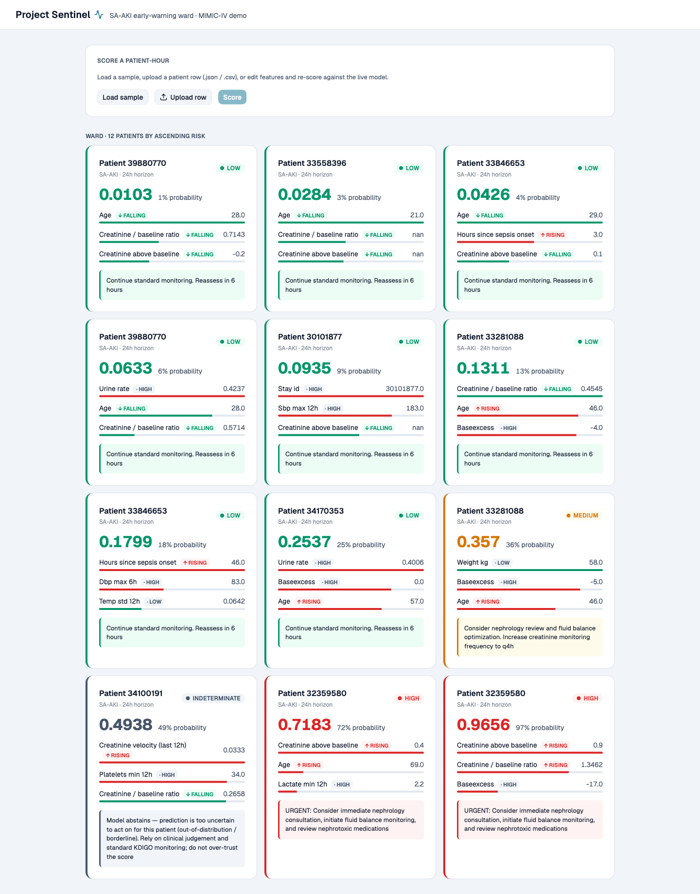
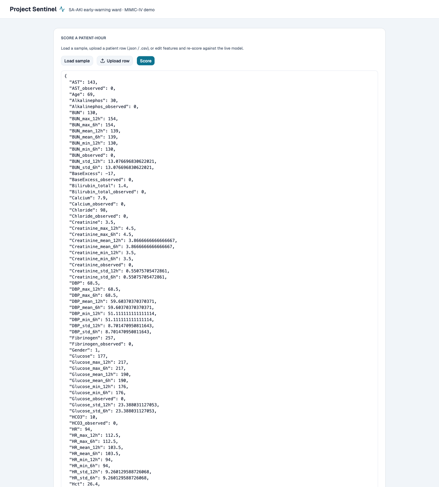
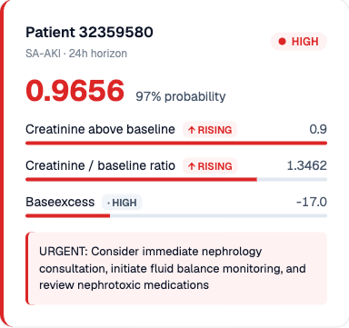

# 🏥 Project Sentinel — Sepsis-Associated AKI Early-Warning System

**A working, end-to-end ML product that predicts Acute Kidney Injury in ICU patients *before* it happens — with calibrated risk scores, SHAP explanations, and a ward dashboard.**

> *"What is the probability that this ICU patient will meet KDIGO AKI Stage ≥1 criteria within the next 6, 12, or 24 hours?"*

### 🔗 Live demo: **https://sng43-sentinel-poc.hf.space/**
### 🎬 5-minute walkthrough video: **https://youtu.be/cirwXUT0lnM**



---

## Contents

- [What it is](#what-it-is)
- [The product](#the-product)
- [Quickstart — run it locally](#quickstart--run-it-locally)
- [Deployment](#deployment)
- [Testing](#testing)
- [Results & analysis](#results--analysis)
- [Discussion — why the milestones matter](#discussion--why-the-milestones-matter)
- [Recommendations & future work](#recommendations--future-work)
- [How the models are built (the pipeline)](#how-the-models-are-built-the-pipeline)
- [Repository layout](#repository-layout)
- [Known limitations](#known-limitations)
- [License](#license)

---

## What it is

Serum creatinine is a **lagging** indicator — a patient can lose more than half their
kidney function before the standard KDIGO criteria flag AKI, by which point it is often
too late to intervene. **Project Sentinel is a proof-of-concept ML system that predicts
Sepsis-Associated AKI (SA-AKI) prospectively**, so a clinician gets a calibrated,
explainable warning hours *before* the damage shows up in the labs.

The intended deployment target is a **resource-limited Rwandan hospital (RMRTH)** running
the **OpenClinic GA** EHR. Because that hospital's data isn't available yet, the models
here are trained on the **open-access MIMIC-IV clinical demo** as a surrogate — the
architecture is built to be retrained on real hospital data with no code changes.

> **This is a proof-of-concept, not a deployable model.** On the 100-patient demo it
> *will* overfit — and it is stated plainly throughout. The deliverable is a **working
> end-to-end product**: real relational ICU data → KDIGO labels → features → calibrated
> risk → SHAP alerts → a live ward dashboard. See [Results & analysis](#results--analysis).

## The product

Two pieces, served from **one URL** in production:

| Layer | Stack | Role |
|---|---|---|
| **Inference backend** | FastAPI + LightGBM + SHAP | Loads the calibrated Stage-2 24h model + a SHAP `TreeExplainer` once at startup, scores a patient-hour, and returns a clinical alert. Endpoints: `GET /health`, `GET /patients`, `GET /sample`, `POST /predict`. |
| **Ward dashboard** | React + Vite + Tailwind | Shows a demo ward spread across the risk spectrum, lets you score a patient-hour, and renders the risk level, the **top-3 SHAP contributors**, and a recommended action. |

Every alert carries three safety-relevant features that distinguish this from a black box:

- **Calibrated probability** — isotonic-regression-calibrated, so a "40% risk" means 40%.
- **SHAP explanation** — the top-3 factors behind *this* score (e.g. *rising creatinine
  velocity*, *low MAP*, *high lactate*).
- **Conformal abstention** — borderline scores return **`INDETERMINATE`** ("I don't know")
  instead of a false-confident number.

| Scoring panel | A scored alert with its SHAP factors |
|---|---|
|  |  |

---

## Quickstart — run it locally

**Prerequisites:** [uv](https://docs.astral.sh/uv/) (Python 3.12) and Node 20+.
The trained demo models (~3 MB) and the ward-demo dataset are committed, so **you do not
need to download or train anything to run the app.** On macOS, LightGBM needs libomp:
`brew install libomp`.

```bash
git clone https://github.com/Sng43/sentinel-poc.git
cd sentinel-poc/project_sentinel
uv sync                                   # create .venv, install deps
```

**Terminal 1 — backend (from `project_sentinel/`):**

```bash
uv run uvicorn backend.app:app --port 8000
# → http://localhost:8000/health  should return {"status":"ok"}
```

**Terminal 2 — frontend:**

```bash
cd frontend
npm install
npm run dev
# → open http://localhost:5173
```

The frontend talks to the backend via `frontend/.env.development` (`VITE_API_URL=http://localhost:8000`).

> **One-URL alternative (production mode):** `cd frontend && npm run build`, then just run
> the backend — it serves the built dashboard at `http://localhost:8000/` alongside the API,
> exactly as the deployed Space does.

---

## Deployment

**Live deployment: https://huggingface.co/spaces/Sng43/sentinel-poc**
(direct app URL: https://sng43-sentinel-poc.hf.space)

**Strategy — one container, one URL.** A two-stage
[`Dockerfile`](project_sentinel/Dockerfile): stage 1 (`node:22-slim`) builds the React
dashboard to static assets; stage 2 (`python:3.12-slim`) installs the locked dependencies
with `uv sync --frozen` (bit-for-bit reproducible from `uv.lock`) and serves the built
dashboard **and** the FastAPI inference API from a single uvicorn process on port 7860 —
no CORS, no separate frontend host.

**Execution.** The deploy is fully scripted — [`deploy/push_to_hf.sh`](deploy/push_to_hf.sh)
stages exactly what the image needs (source, trained models, the git-ignored
`test.parquet`, and the Space config [`deploy/hf-space-README.md`](deploy/hf-space-README.md))
and pushes it to a Hugging Face **Docker Space**, which builds the image and swaps it in
automatically. Re-deploying after any change is one command:

```bash
deploy/push_to_hf.sh https://huggingface.co/spaces/Sng43/sentinel-poc
```

**Verification in the target environment.** After deploy:
[`/health`](https://sng43-sentinel-poc.hf.space/health) returns `{"status":"ok"}`, the ward
dashboard loads at the root URL, and `POST /predict` returns a complete SHAP-explained
clinical alert — the same behaviour the API integration tests assert locally.

**Same image, any other environment** — the identical container runs anywhere Docker does:

```bash
cd project_sentinel
docker build -t sentinel-demo .
docker run -p 7860:7860 sentinel-demo      # → http://localhost:7860
```

---

## Testing

Full detail, results, and screenshots: **[TESTING.md](TESTING.md)**. In short — three
strategies, **17 automated tests passing**, plus a cross-environment latency benchmark:

```bash
cd project_sentinel
uv sync --group dev
uv run pytest -q                 # 17 passed
uv run python bench_latency.py   # p50/p95 latency of /predict
```

| Strategy | Covers | Result |
|---|---|---|
| **Clinical-logic unit tests** | KDIGO creatinine/urine criteria (incl. "0 mL/kg/h = anuria, not missing"), risk thresholds, conformal band | 7/7 ✅ |
| **API integration tests** | every endpoint end-to-end + edge cases: all-missing patient, malformed → 422, extreme values, carried patient id | 10/10 ✅ |
| **Performance benchmark** | `/predict` latency, compute-only vs. over-HTTP (and cloud, post-deploy) | p50 **~4.3 ms** per alert |

Edge cases exercised with **different data values** — valid, empty (brand-new admission,
all NaN), malformed, clinically extreme, and abstention-band inputs — are tabulated in
[TESTING.md §3](TESTING.md#3-different-data-values--edge-cases).

---

## Results & analysis

Headline metrics — **Stage-2 LightGBM @ 24 h, held-out test split** (100-patient MIMIC-IV
demo, 1,965 patient-hours):

| Metric | Value | Reading |
|---|---|---|
| **AUROC** | **0.66** | Modest — and, crucially, **not fake-perfect**. A target leak would force it toward 1.0. |
| **AUPRC** | **0.50** | Well above the ~26% positive base rate at 24 h. |
| **Brier** | 0.20 | — |
| **ECE (calibration error)** | **0.11** | Probabilities are usable, not wildly over/under-confident. |
| Specificity / PPV (@0.5) | 0.90 / 0.59 | Few false alarms; a fired alert is right ~59% of the time. |

**Did it meet the proposal objectives?**

| Objective (from the proposal) | Outcome |
|---|---|
| A **working end-to-end** SA-AKI pipeline on real relational ICU data | ✅ **Achieved** — load → KDIGO labels (creatinine **and** urine) → features → train → eval → explain → serve, all run end-to-end. |
| **Calibrated, honest** risk (not a leaky 0.99-AUROC illusion) | ✅ **Achieved** — isotonic calibration; ECE 0.11; AUROC 0.66 is the *proof* there's no leakage. |
| **Explainable, safe** alerts | ✅ **Achieved** — SHAP top-3 per alert + conformal `INDETERMINATE` abstention. |
| A **usable, deployed** product | ✅ **Achieved** — FastAPI + React dashboard, one-URL Docker deploy, ~4 ms/alert. |
| **Discrimination target AUROC > 0.75** | ⚠️ **Missed by design** — 0.66 on 100 patients. This target applies to full MIMIC-IV; see [dataset sizing](#known-limitations). |
| **Fairness across subgroups** | ⚠️ **Gap surfaced, honestly reported** — AUROC **0.74 (<65)** vs **0.62 (65+)**, with worse calibration on the elderly (ECE 0.06 vs 0.19). |

The missed items are **expected consequences of a 100-patient demo, not implementation
failures** — the point of this PoC is that the *pipeline and product* work, not that this
particular model is deployable. The subgroup gap is exactly the kind of finding the
evaluation suite exists to catch before anything reaches a bedside.

## Discussion — why the milestones matter

- **The pipeline milestone is the hard, reusable asset.** Turning messy, multi-table ICU
  records into leakage-free KDIGO labels — using *both* the creatinine and the mask-aware
  urine-output criteria, labelling from raw measurements *before* the chronological split —
  is where clinical ML usually goes silently wrong. Getting that right is what makes
  retraining on RMRTH data a data problem, not a rebuild.
- **Calibration + abstention is what makes it safe to show a clinician.** An early-warning
  score that is confidently wrong destroys trust faster than no score at all. Isotonic
  calibration (ECE 0.11) plus a conformal "I don't know" band is the difference between a
  research artefact and something a ward could reason about.
- **The deployment milestone proves the whole path.** A calibrated model in a notebook
  helps no one. Scoring a patient-hour into an explained alert in ~4 ms, served from one
  URL, is the evidence that the path from data to bedside actually closes.

**Impact:** the product is architecturally ready to be retrained on the target hospital's
OpenClinic GA data. The evaluation and fairness tooling means that when it is, the same
run will immediately surface whether it is trustworthy for *that* population.

## Recommendations & future work

**For the community / anyone applying this:**

- **Do not deploy this demo model clinically.** It overfits 100 patients. The transferable
  value is (a) the end-to-end pipeline and (b) the *design pattern* — calibrated
  probabilities + SHAP + conformal abstention — for a trustworthy clinical EWS.
- **Re-validate on your own population.** The elderly-subgroup gap shows performance is
  population-specific; SA-AKI aetiology at RMRTH (severe malaria, tropical infection)
  differs from a US ICU, so local retraining is mandatory, not optional.

**Future work (roadmap):**

1. Train on **full MIMIC-IV** (~70–90k stays; PhysioNet DUA application in progress) to
   clear the sizing floor, then externally validate on **eICU-CRD / AmsterdamUMCdb**.
2. Add the **SOFA ≥ 2** component to the sepsis-onset definition (currently
   suspicion-of-infection only).
3. Wire a **live OpenClinic GA feed** in place of the in-memory demo set.
4. Add **nephrotoxic-drug** and **novel-biomarker** (NGAL, TIMP-2·IGFBP7) features once the
   hospital can supply them.

---

## How the models are built (the pipeline)

The models the app serves are produced by a 7-notebook pipeline (`project_sentinel/notebooks/`,
run 01→07) that mirrors the `src/` modules. You only need this to **retrain** — the app runs
off the committed artefacts.

```
Stage 1 (screener)          Stage 2 (confirmer)
vitals only, LightGBM   ──▶ all 198 features, LightGBM + XGBoost (Optuna-tuned)
low latency, high recall    high precision, reduces alarm fatigue
        │                           │
        └───────────────┬───────────┘
                        ▼
          Isotonic calibration → risk score → SHAP alert → conformal abstention
```

Separate models per horizon (**6 h, 12 h, 24 h**). Stage 1 simulates the labs-unavailable
scenario common in district hospitals.

| NB | Does | Writes |
|---|---|---|
| 01 | download → load tables → hourly reshape → sepsis onset | `interim/hourly_cohort.parquet` |
| 02 | inclusion criteria → baseline creatinine → prevalent-AKI exclusion | `interim/cohort_defined.parquet` |
| 03 | missingness → rolling → impute → velocity → composites | `interim/engineered_features.parquet` |
| 04 | KDIGO labels (creatinine + urine) → **then** chronological split | `processed/{train,val,test}.parquet` |
| 05 | Stage-1 + Stage-2 (Optuna) → isotonic calibration | `models/…` |
| 06 | AUROC/AUPRC/ECE, ROC/PR/calibration/DCA, subgroups | `outputs/figures`, `outputs/reports` |
| 07 | SHAP summaries, waterfalls, clinical-alert JSON | `outputs/explain_*` |

To reproduce from scratch, first fetch the open-access demo data (no credentialing):

```bash
cd project_sentinel
uv run python ../mimic_demo_project/download_mimic_demo.py data/raw/mimic_iv_demo
uv run jupyter lab          # run notebooks 01 → 07 in order
```

**KDIGO Stage-1 AKI** is flagged if **either** channel is met:
- **Creatinine:** rise ≥ 0.3 mg/dL above baseline, **OR** ≥ 1.5× baseline.
- **Urine output:** < 0.5 mL/kg/h sustained for ≥ 6 h (mask-aware; unobserved hours never
  counted as anuria).

## Repository layout

```
sentinel-poc/
├── README.md                     ← this file
├── TESTING.md                    ← testing strategies, results, screenshots
├── report_assets/                ← dashboard screenshots + eval figures
├── deploy/                       ← Hugging Face Space README + one-command push script
├── mimic_demo_project/
│   └── download_mimic_demo.py    ← open-access MIMIC-IV demo downloader (stdlib only)
└── project_sentinel/             ← run commands from here
    ├── Dockerfile                ← two-stage build: React frontend + FastAPI, one image
    ├── pyproject.toml            ← deps (uv, Python 3.12)
    ├── src/                      ← data_loader · labels · features · models · evaluation · explain · conformal
    ├── notebooks/                ← 01→07 pipeline
    ├── backend/app.py            ← FastAPI inference API (serves the built SPA in prod)
    ├── frontend/                 ← React + Vite + Tailwind ward dashboard
    ├── tests/                    ← pytest suite (unit + API integration)
    ├── bench_latency.py          ← /predict latency benchmark
    ├── models/                   ← committed demo models (~3 MB) + calibrators + metadata
    └── data/processed/test.parquet  ← committed ward-demo set (required by the app)
```

## Known limitations

These are specification gaps that real hospital data closes — not failures of the PoC:

| # | Limitation | Mitigation path |
|---|---|---|
| 1 | **100-patient demo → overfits**; AUROC 0.66, not > 0.75 | Full MIMIC-IV (~70–90k stays) clears the sizing floor. |
| 2 | **Baseline creatinine** = in-stay pre-sepsis minimum | Full data uses 7–365-day pre-admission outpatient creatinine. |
| 3 | **Sepsis onset** = suspicion-of-infection only | Add the SOFA ≥ 2 component. |
| 4 | **Western ICU population**; elderly-subgroup gap | Retrain on local (RMRTH) data; SA-AKI aetiology differs. |
| 5 | **No medication / novel-biomarker features** | Populate from EHR pharmacy + assay records. |
| 6 | **In-memory demo feed**, not a live EHR | Wire an OpenClinic GA adapter. |

**Dataset sizing:** the demo trains on ~96 unique patients — far below the ~1–2k *floor*
where results stop being noise, and the ~10–20k *favorable* tier where subgroup splits hold
up. This is *why* it overfits; it is documented, not hidden.

## License

Uses publicly available datasets under the
[Open Data Commons Attribution License v1.0](https://opendatacommons.org/licenses/by/1.0/).
The MIMIC-IV clinical demo is open-access (PhysioNet). Full MIMIC-IV is credentialed and is
**never** committed to this repository.
