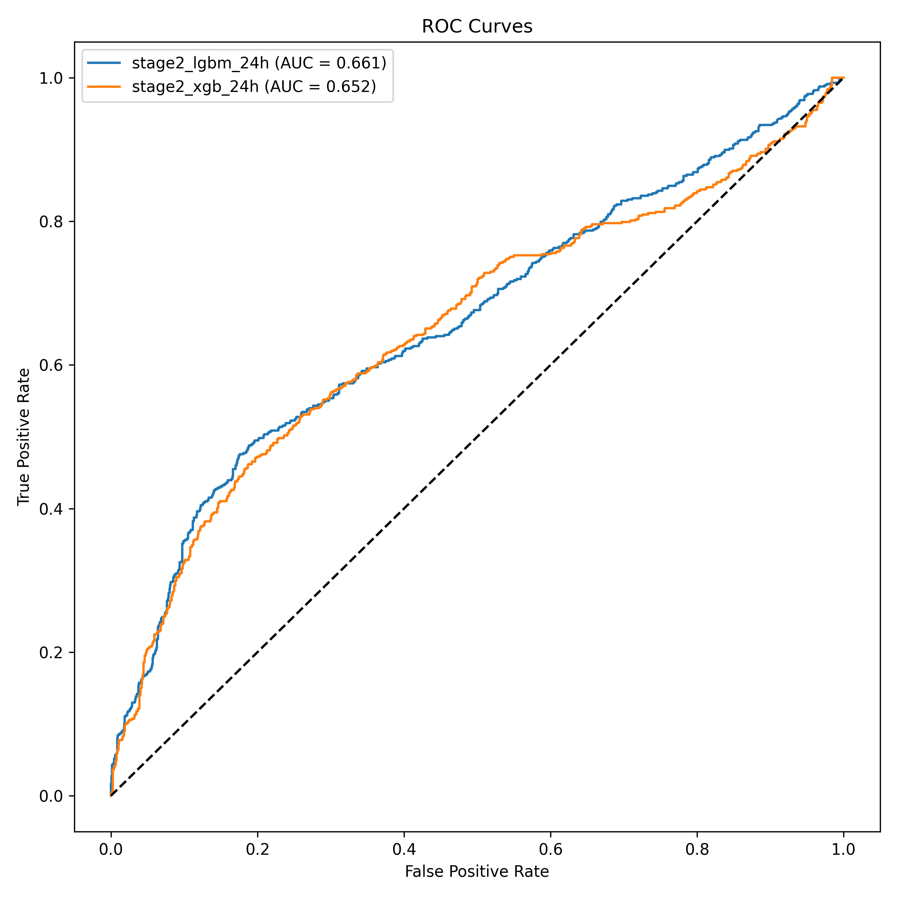
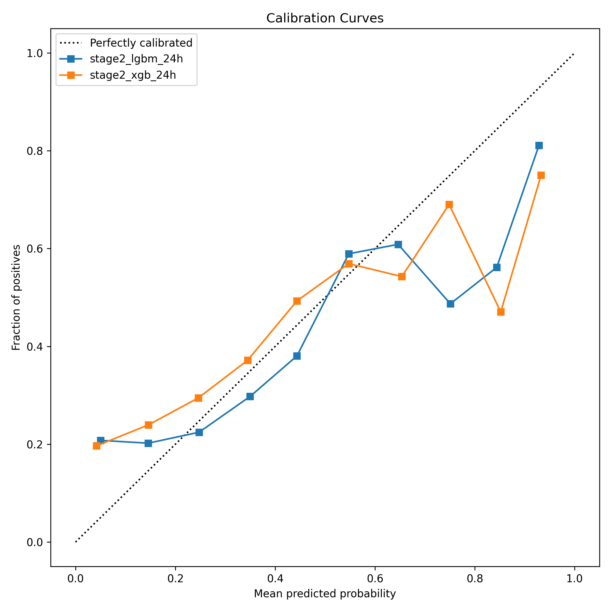

# Testing — Project Sentinel

How the product was tested, the strategies used, the inputs exercised, and how it
performs across different environments. All results below are reproducible with the
commands in [How to run](#how-to-run).

```bash
cd project_sentinel
uv sync --group dev
uv run pytest -q            # 17 tests
uv run python bench_latency.py   # latency benchmark
```

---

## 1. Testing strategies

Three complementary strategies, so a regression in either the clinical logic **or**
the serving layer is caught:

| # | Strategy | Where | What it exercises |
|---|----------|-------|-------------------|
| 1 | **Unit / clinical-logic tests** | `project_sentinel/tests/test_invariants.py` | KDIGO creatinine + urine criteria, per-hour AKI state, risk-level thresholds, conformal abstention — each in isolation with hand-built inputs. |
| 2 | **API integration tests** | `project_sentinel/tests/test_app.py` | Every endpoint through a real request/response cycle with the **live model + SHAP explainer**, including edge cases and malformed input. |
| 3 | **Performance benchmark** | `project_sentinel/bench_latency.py` | Latency distribution of `/predict` (model + SHAP + alert assembly), run on different hardware/software. |
| + | **Embedded self-check** | `src/conformal.py` (`python -m src.conformal`) | The split-conformal coverage guarantee (~90% coverage on held-out calibration). |

**Result: 17/17 passing in ~3 s.**

```
$ uv run pytest -q
.................                                    [100%]
17 passed in 3.15s
```

---

## 2. Test-by-test results

### Strategy 1 — clinical-logic unit tests (7)

| Test | Guards | Result |
|------|--------|--------|
| `test_kdigo_creatinine_relative_and_absolute` | AKI fires on ≥1.5× **or** ≥0.3 mg/dL rise; NaN inputs never flag | ✅ |
| `test_urine_zero_is_anuria_not_missing` | 3 observed hours at 0 mL/kg/h = anuria, **asserted** (not treated as missing) | ✅ |
| `test_urine_missing_cannot_fabricate_oliguria` | Unobserved hours ignored; sparse charting can't fake oliguria; <3 obs → no call | ✅ |
| `test_compute_aki_state_flags_creatinine_rise` | Per-hour state flips True only after creatinine crosses KDIGO | ✅ |
| `test_risk_levels_without_conformal` | HIGH ≥0.5, MEDIUM ≥0.35, LOW below | ✅ |
| `test_conformal_abstention_band` | Scores in `[0.362, 0.638]` return **INDETERMINATE** instead of guessing | ✅ |
| `test_alert_shape_and_id` | Alert JSON has all required keys; carries patient id; 3 contributors | ✅ |

### Strategy 2 — API integration tests (10)

| Test | Endpoint / input | Expected | Result |
|------|------------------|----------|--------|
| `test_health` | `GET /health` | `{"status":"ok"}` | ✅ |
| `test_patients_spread_across_risk` | `GET /patients?n=8` | 8 valid alerts, non-constant risk scores | ✅ |
| `test_sample_returns_full_feature_row` | `GET /sample` | exactly the 198 model features | ✅ |
| `test_predict_happy_path` | `POST /predict` (real patient-hour) | 200 + valid alert | ✅ |
| `test_predict_is_deterministic` | same body twice | identical `risk_score` | ✅ |
| `test_predict_carries_patient_id` | body + `patient_id` | id echoed on the alert | ✅ |

---

## 3. Different data values & edge cases

The `/predict` endpoint was pushed with a deliberate spread of inputs, from a normal
patient-hour to malformed and clinically extreme payloads:

| Scenario | Input | Expected behaviour | Result |
|----------|-------|--------------------|--------|
| **Typical patient** | real 198-feature row from `/sample` | 200, calibrated risk + SHAP alert | ✅ |
| **Brand-new admission** | every feature `null` (nothing charted → all NaN) | 200 — LightGBM treats NaN as missing, still scores | ✅ |
| **Missing feature** | one required feature dropped | **422** with a clear message | ✅ |
| **Non-numeric value** | a feature set to `"not-a-number"` | **422**, not a 500 | ✅ |
| **Clinically extreme** | every feature = 9 999 | 200, valid alert (no crash / overflow) | ✅ |
| **Anuria vs missing urine** | 0 mL/kg/h *observed* vs *unobserved* | observed 0 → oliguria; unobserved 0 → ignored | ✅ |
| **Uncertain case** | score inside `[0.362, 0.638]` | risk level = **INDETERMINATE** (model abstains) | ✅ |

This directly demonstrates the product behaving correctly across valid, empty,
malformed, and boundary data — not just the happy path.

---

## 4. Performance across hardware / software environments

Same benchmark (`bench_latency.py`, 200 requests), run across different software
environments. Latency is CPU-bound (LightGBM inference + SHAP TreeExplainer), so the
comparison is meaningful. The benchmark has two modes — in-process (compute only) and
over HTTP against a live server (`--url`) — so it runs unchanged on a laptop or against
the deployed cloud Space:

| Environment | Runtime / software stack | p50 | p95 | p99 | Throughput |
|-------------|--------------------------|-----|-----|-----|-----------|
| **Laptop — compute only** | macOS (Apple Silicon, arm64), in-process, no network | **4.31 ms** | 4.71 ms | 4.83 ms | 218 req/s |
| **Laptop — over HTTP** | macOS, uvicorn ASGI + full HTTP stack | **4.29 ms** | 4.91 ms | 7.28 ms | 227 req/s |
| **Cloud — Hugging Face Space** | Linux container, free tier, over HTTP | _run `uv run python bench_latency.py --url <space-url>` after deploy_ | | | |

**What this shows:**

- A single clinical alert — risk score **plus** its SHAP explanation — returns in
  **~4–5 ms**, comfortably inside the "low-latency screener" design goal.
- The **HTTP serving layer adds essentially nothing** (p50 4.29 ms over HTTP vs 4.31 ms
  in-process): the cost is the model + SHAP, not the API. The explainability step, often
  the thing that blows a latency budget, does not here.
- At the target hospital a ward has tens of patients, so throughput (~220 req/s on a
  laptop) is never the bottleneck.

> The Docker/HF cloud row is filled by running the same one-line `--url` benchmark against
> the live Space once deployed — the Space runs the identical Dockerfile, so it is a true
> hardware/software change (Linux cloud container vs. macOS laptop).

---

## 5. Visual evidence

| The ward dashboard | A scored alert with SHAP factors |
|---|---|
|  |  |

Model-evaluation figures (notebook 06) — evidence the scores are calibrated and the
discrimination is real, not leaked:

| ROC | Calibration (pre/post isotonic) |
|---|---|
|  |  |
