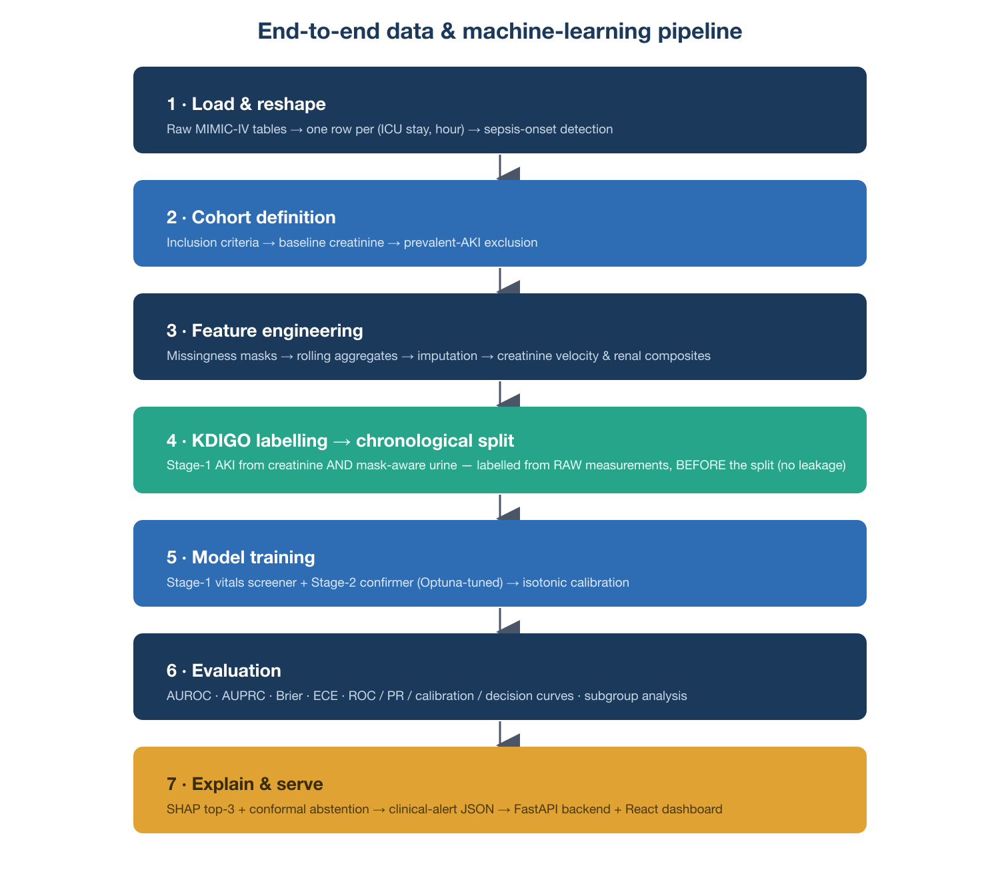
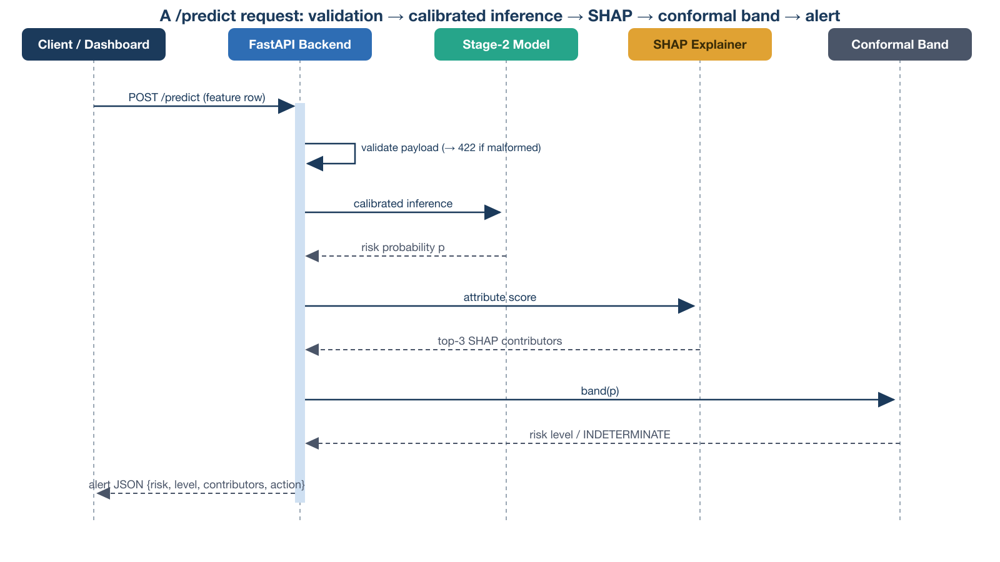
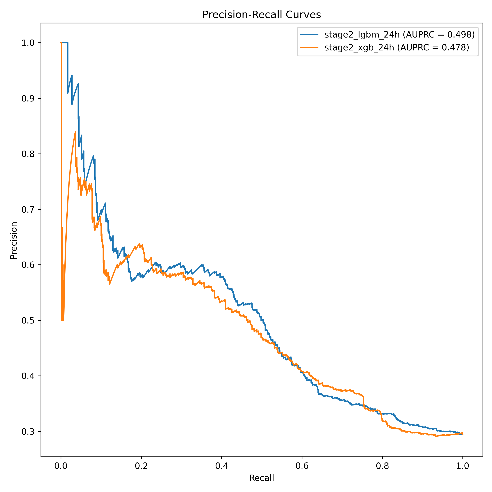
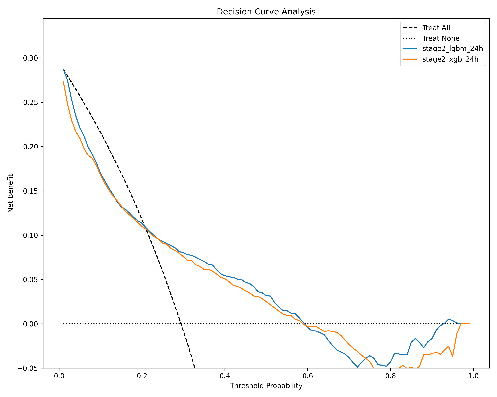

# Project Sentinel: An Explainable Early-Warning System for Sepsis-Associated Acute Kidney Injury

**Senga Kabare Emmanuel**

BSc. in Software Engineering, African Leadership University, Kigali, Rwanda

\newpage

## Declaration

This Capstone Project report is my original work, unless stated otherwise, and all external sources have been referenced or cited in this document. This work has not been presented for the award of a degree or for any similar purpose in any other university.

Signature: ……………………………

Date: ……………………………

Name of Student: Senga Kabare Emmanuel

\newpage

## Certification

The undersigned certifies that he has read and hereby recommends for acceptance by the African Leadership University a report entitled **"Project Sentinel: An Explainable Early-Warning System for Sepsis-Associated Acute Kidney Injury."**

Signature: ……………………………

Date: ……………………………

Simeon Nsabiyumva

Supervisor, Bachelor of Software Engineering, African Leadership University

\newpage

## Dedication and Acknowledgement

> **[⚑ SUPPLY: Your dedication and acknowledgements. A suggested draft is below — edit freely or replace.]**

I dedicate this work to the clinicians of Rwanda's referral hospitals, whose daily effort to recognise critical illness earlier motivated this project.

I thank my supervisor, Simeon Nsabiyumva, for his guidance throughout the design and evaluation of this system; the faculty of the Bachelor of Software Engineering at the African Leadership University for their instruction and feedback; and the PhysioNet team and the MIMIC-IV investigators at the Massachusetts Institute of Technology and the Beth Israel Deaconess Medical Center, whose open-access clinical data made this proof-of-concept possible.

\newpage

## Abstract

Sepsis-associated acute kidney injury (SA-AKI) is a leading driver of mortality among critically ill patients, and its diagnosis is delayed by the fact that serum creatinine — the primary biomarker — is a lagging indicator that rises only after substantial, often irreversible, kidney damage has occurred. This problem is most acute in resource-limited settings such as Rwanda, where urine-output monitoring is infrequent and baseline creatinine is often unavailable. This project designed, built, and evaluated **Project Sentinel**, an explainable machine-learning early-warning system that estimates the probability that an intensive-care patient will meet KDIGO Stage ≥ 1 AKI criteria within the next 6, 12, or 24 hours. Because credentialed access to hospital data was delayed beyond the capstone window, the system was developed and validated as a **proof-of-concept** on the open-access MIMIC-IV clinical demonstration dataset (100 patients, 136 ICU stays, 12,413 patient-hours), with the pipeline deliberately built so that it can be retrained on hospital data without code changes. A cascaded two-stage gradient-boosting architecture (a LightGBM vitals-only screener followed by an Optuna-tuned LightGBM/XGBoost confirmer) was trained per horizon, calibrated with isotonic regression, explained with SHAP, and guarded by a split-conformal abstention layer that returns *INDETERMINATE* for borderline cases. The complete pipeline — relational ICU data → KDIGO labelling → feature engineering → calibrated risk → explained alert — was implemented end-to-end, served through a FastAPI backend and a React ward dashboard, and deployed publicly as a single-container Hugging Face Space. On the held-out test split the Stage-2 24-hour model achieved an AUROC of 0.66, an AUPRC of 0.50, and an expected calibration error of 0.11. These modest figures are the expected consequence of a 100-patient dataset and, crucially, are the evidence that the labels contain no target leakage. The contribution of this work is a working, honest, and reusable clinical-ML pipeline together with a trustworthy-alert design pattern, both ready for retraining on the full MIMIC-IV dataset (94,458 ICU stays), for which credentialed access has since been secured.

***Keywords:*** *Sepsis-Associated Acute Kidney Injury, Early-Warning System, Machine Learning, Calibration, SHAP, Conformal Prediction, Clinical Decision Support, MIMIC-IV.*

\newpage

## Table of Contents

> **[⚑ IN WORD: place the cursor here, then References → Table of Contents → *Automatic Table*. Word will build the contents from the heading styles in this document; right-click → *Update Field* whenever the text changes.]**

\newpage

## List of Tables

- Table 1: Strengths and weaknesses of existing AKI decision-support systems
- Table 2: Functional requirements (as-built vs. deferred)
- Table 3: Non-functional requirements (as-built vs. deferred)
- Table 4: Development tools actually used
- Table 5: Test suite and results
- Table 6: Edge-case behaviour of the /predict endpoint
- Table 7: Cross-environment latency
- Table 8: Headline model performance (Stage-2, 24 h, test split)
- Table 9: Subgroup / fairness analysis (Stage-2 LightGBM, 24 h)
- Table 10: Objectives set in the proposal vs. outcomes delivered

## List of Figures

- Figure 1: Two-stage cascaded model architecture
- Figure 2: End-to-end data and machine-learning pipeline
- Figure 3: `/predict` request sequence
- Figure 4: The Project Sentinel ward dashboard
- Figure 5: Patient scoring panel
- Figure 6: A scored alert with SHAP contributors and conformal band
- Figure 7: ROC curves
- Figure 8: Calibration curves (pre- and post-isotonic)
- Figure 9: Precision–recall curves
- Figure 10: Decision-curve analysis

\newpage

## List of Acronyms / Abbreviations

| Acronym | Meaning |
|---|---|
| AKI | Acute Kidney Injury |
| API | Application Programming Interface |
| AUPRC | Area Under the Precision–Recall Curve |
| AUROC | Area Under the Receiver Operating Characteristic curve |
| BUN | Blood Urea Nitrogen |
| CDSS | Clinical Decision Support System |
| DSR | Design Science Research |
| DUA | Data Use Agreement |
| ECE | Expected Calibration Error |
| EHR | Electronic Health Record |
| ICU | Intensive Care Unit |
| KDIGO | Kidney Disease: Improving Global Outcomes |
| LightGBM | Light Gradient Boosting Machine |
| LMIC | Low- and Middle-Income Countries |
| MAP | Mean Arterial Pressure |
| MIMIC-IV | Medical Information Mart for Intensive Care, version IV |
| ML | Machine Learning |
| NPV | Negative Predictive Value |
| PPV | Positive Predictive Value |
| RMRTH | Rwanda Military Referral and Teaching Hospital |
| SA-AKI | Sepsis-Associated Acute Kidney Injury |
| SHAP | SHapley Additive exPlanations |
| SOFA | Sequential Organ Failure Assessment |
| UOP | Urine Output |
| XAI | Explainable Artificial Intelligence |
| XGBoost | Extreme Gradient Boosting |

\newpage

# Chapter One: Introduction

## 1.1 Introduction and Background

Acute Kidney Injury (AKI) is a critical clinical syndrome characterised by a rapid decline in renal excretory function, often resulting in severe systemic complications and high mortality. In May 2025, the 78th World Health Assembly adopted a resolution on kidney health, directing member states to prioritise kidney-disease prevention and to integrate renal care into universal health coverage (World Health Organization, 2025). This mandate aligns with the Kidney Disease: Improving Global Outcomes (KDIGO) clinical practice guideline for AKI, which defines the syndrome by an increase in serum creatinine of at least 0.3 mg/dL within 48 hours, or by a sustained reduction in urine output, while placing new emphasis on validated electronic alerts and structural biomarkers for earlier risk prediction (Kidney Disease: Improving Global Outcomes [KDIGO], 2012).

Sepsis remains the leading driver of AKI, accounting for 45% to 70% of all cases in critically ill populations (Peerapornratana et al., 2019). Translating the global mandate into clinical impact is especially difficult in resource-limited settings such as sub-Saharan Africa, where diagnostic delays and limited therapeutic access drive high mortality. In Malawi, community-acquired infection-associated AKI has been linked to in-hospital mortality as high as 44.4% (Evans et al., 2017). Local prospective data mirror this: at the University Teaching Hospital of Kigali and King Faisal Hospital, 28-day mortality among adult sepsis patients reached 29.1%, with delayed clinical recognition carrying the highest independent odds of death (Sugira et al., 2015). Among Rwandan patients whose AKI was severe enough to require haemodialysis, mortality was approximately 34.1%, with sepsis and severe malaria the primary contributors (Igiraneza et al., 2018). A recent multi-centre audit found that 76.3% of paediatric patients recognised with AKI at Rwandan district hospitals already presented at KDIGO Stage 3 — the most advanced stage — at the time of first recognition (Rugamba et al., 2026).

Traditional diagnosis is fundamentally limited because serum creatinine is a physiological *lagging indicator*: it often remains within normal ranges until up to 50% of functional kidney capacity is already lost (Peerapornratana et al., 2019). In resource-constrained settings this latency is worsened by missing baseline creatinine and infrequent urine-output monitoring, documented in only 3.6% of audited cases in recent Rwandan reviews (Rugamba et al., 2026). This creates a *silent window* in which renal damage becomes irreversible before standard biochemical criteria are met — a window that computational early-warning systems have demonstrated the capacity to close by 6 to 24 hours (Shi et al., 2024).

Algorithmic decision support offers a responsive alternative by identifying subtle, non-linear physiological patterns before biochemical injury manifests. Strong gradient-boosting baselines such as XGBoost and LightGBM routinely achieve AUROC scores of 0.77 to 0.81 for predicting SA-AKI (Shi et al., 2024), while deep sequence models can reach higher discrimination on dense, high-frequency time-series (Ratchatorn et al., 2026). **Project Sentinel** was conceived to bring this class of tool to a resource-limited context: by analysing routinely collected clinical variables and surfacing each decision through an interpretable explanation (SHapley Additive exPlanations, or SHAP), the system aims to shift renal care from reactive management to context-aware early warning.

This report describes the version of Project Sentinel that was actually designed, built, and evaluated within the capstone timeframe. As set out in Section 1.5 and Chapter Three, the project was executed as a **proof-of-concept** trained on the open-access MIMIC-IV clinical demonstration dataset, because credentialed access to hospital-scale data was delayed beyond the development window. The engineering objective — a complete, honest, and reusable pipeline from relational ICU data to an explained bedside alert — was met; the modelling objective of high discrimination was, by design, deferred to the full dataset for which access has since been obtained.

## 1.2 Problem Statement

The clinical management of SA-AKI in resource-limited tertiary care is fundamentally hindered by the diagnostic latency of traditional biomarkers (Peerapornratana et al., 2019). Current protocols rely on serum creatinine and urine output, both of which manifest change only after substantial, often irreversible, structural damage has occurred. The consequence is captured by the finding that 76.3% of Rwandan patients recognised with AKI already presented at KDIGO Stage 3 (Rugamba et al., 2026) — a widespread failure of early detection.

Compounding this, there is a scarcity of contextually appropriate predictive tools for these environments (Fraser et al., 2022). Machine-learning models developed in high-income settings frequently depend on dense, high-frequency data sampling that is rarely complete in low-resource digital-health infrastructure, and models trained exclusively on Western datasets carry a risk of bias when applied to local cohorts, where sepsis commonly intersects with severe tropical infection and dehydration (Evans et al., 2017; Igiraneza et al., 2018). Finally, clinician scepticism toward opaque "black-box" systems is a major barrier to adoption, because clinical decision support must be transparent and blend into busy workflows to be trusted (Shortliffe & Sepúlveda, 2018).

The problem this project addressed is therefore twofold: (1) the *clinical* problem of a missing early-warning capability for SA-AKI, and (2) the *engineering* problem of whether a trustworthy, explainable, and honestly-calibrated pipeline for that capability can be built end-to-end from real relational ICU data using only a streamlined feature set and open-source tooling suitable for a resource-limited deployment.

## 1.3 Project's Main Objective

The main objective of this project was to design, build, and evaluate an explainable machine-learning early-warning software system — Project Sentinel — that predicts the prospective onset of SA-AKI from routinely collected ICU data, and to deliver it as a working, deployed, end-to-end product whose risk scores are calibrated, explained, and safe to present to a clinician.

In alignment with the World Health Organization's (2025) resolution on kidney health, the system's purpose is to help transition renal care from reactive treatment to proactive, context-aware early warning, thereby targeting the morbidity and mortality associated with late-stage SA-AKI.

### 1.3.1 Specific Objectives

To achieve the main objective, the project pursued the following specific objectives, described here as they were actually carried out:

1. **Data engineering and labelling.** To transform raw, multi-table ICU records into a canonical hourly cohort and to derive leakage-free KDIGO Stage-1 AKI labels from *both* the serum-creatinine and the mask-aware urine-output criteria.
2. **Feature engineering.** To construct a clinically motivated feature set — missingness masks, rolling physiological aggregates, creatinine velocity, and composite ratios — from the canonical schema.
3. **Model development and calibration.** To design, train, and calibrate a cascaded two-stage gradient-boosting architecture (a LightGBM vitals-only screener and an Optuna-tuned LightGBM/XGBoost confirmer) for the 6-, 12-, and 24-hour horizons, with isotonic calibration so that predicted risks map to empirical probabilities.
4. **Explainability and safety.** To attach a per-alert SHAP explanation identifying the top contributing factors, and a split-conformal abstention layer that returns *INDETERMINATE* rather than a false-confident number for borderline cases.
5. **Evaluation.** To evaluate discrimination, calibration, and clinical utility (AUROC, AUPRC, Brier score, expected calibration error, and decision-curve analysis) and to perform a subgroup / fairness analysis.
6. **Productisation and deployment.** To serve the calibrated model through an API and a ward dashboard, to test it across unit, integration, and performance strategies, and to deploy it as a single-container public application.

The proposal additionally set a discrimination target of AUROC 0.85–0.92 and envisaged integration with a live hospital database; as explained in Section 1.5 and Chapter Seven, these were deferred to full-scale data and are treated as future work rather than deliverables of this proof-of-concept.

## 1.4 Research Questions

1. **Predictors.** What are the most significant physiological and biochemical predictors of SA-AKI that can be derived from routinely collected ICU data, and how do they surface in a per-patient explanation?
2. **Pipeline feasibility.** Can a leakage-free, end-to-end pipeline — from raw relational ICU data to KDIGO labels, calibrated risk, and an explained alert — be built and validated on real ICU data using only a streamlined, open-source toolchain?
3. **Trustworthiness.** To what extent do isotonic calibration and conformal abstention make the system's outputs honest and safe to present to a clinician, as measured by calibration error and abstention behaviour?
4. **Deployability.** Can the resulting system be served and deployed as a low-latency, single-URL product suitable for a resource-limited environment?

## 1.5 Project Scope

The scope of this project was the design, implementation, evaluation, and deployment of a **proof-of-concept** SA-AKI early-warning system. The following boundaries applied and are stated explicitly because they differ from the broader vision set out in the proposal:

- **Data.** The system was trained and evaluated on the **open-access MIMIC-IV clinical demonstration dataset** (Johnson, Bulgarelli, et al., 2023; Goldberger et al., 2000) — 100 patients — used as a surrogate for hospital data. Credentialed access to the full MIMIC-IV dataset (Johnson et al., 2024) was pursued in parallel; because that credentialing (institutional registration, human-subjects training, and a signed Data Use Agreement) completed after the development window closed, all results in this report are on the demonstration dataset. The pipeline was deliberately engineered so that retraining on the full dataset — or on a hospital's own data — requires no code changes.
- **Prediction task.** Prospective *onset* prediction of KDIGO Stage ≥ 1 AKI at 6-, 12-, and 24-hour horizons — not classification of AKI that has already occurred.
- **Delivered system.** A cascaded two-stage gradient-boosting model, isotonic calibration, SHAP explanations, conformal abstention, a FastAPI inference backend, a React ward dashboard, and a public single-container deployment.
- **Out of scope for this proof-of-concept** (documented as future work in Chapter Seven): live integration with the OpenClinic GA hospital database; deep temporal architectures (RNN/LSTM/Transformer); authentication, role-based access control, and audit persistence; and prospective clinical evaluation.

The work is non-interventional and uses only de-identified, publicly available data; it makes no contact with live patients.

## 1.6 Significance and Justification

The significance of this project is primarily *methodological and architectural*. The transferable asset is not the particular model — which, as the discussion in Chapter Six shows, overfits a 100-patient dataset — but (a) a correct, leakage-free, end-to-end pipeline for turning messy relational ICU data into calibrated SA-AKI risk, and (b) a reusable design pattern for a *trustworthy* clinical early-warning alert: a calibrated probability, a SHAP explanation, and a conformal "I don't know" band. Getting the pipeline right is precisely where clinical machine learning most often fails silently, so a validated pipeline turns the eventual move to hospital data into a data problem rather than a rebuild.

Practically, the design directly targets the documented failures of the local context: the mask-aware urine-output criterion respects the reality that absent charting must never be read as anuria, and the streamlined feature set is compatible with the sparse, low-frequency data typical of resource-limited EHRs. Academically, the project contributes a replicable, open-source blueprint for building and honestly evaluating an SA-AKI early-warning system, including the fairness tooling that surfaces subgroup performance gaps before anything reaches a bedside.

## 1.7 Research Budget

The project was executed entirely on open-source software and open-access data, so direct monetary cost was negligible; the principal cost was the researcher's time.

> **[⚑ SUPPLY: replace the indicative figures below with your actual budget, or keep as an indicative table. ALU expects a budget table even where costs are nominal.]**

| Item | Description | Indicative cost (USD) |
|---|---|---|
| Compute | Personal laptop (Apple Silicon); no GPU or cloud training required | 0 |
| Data | MIMIC-IV clinical demonstration dataset (open-access) | 0 |
| Deployment | Hugging Face Spaces (free tier) | 0 |
| Software | Python, uv, LightGBM, XGBoost, scikit-learn, SHAP, FastAPI, React (all open-source) | 0 |
| PhysioNet credentialing | Human-subjects training and Data Use Agreement (no fee) | 0 |
| **Total** | | **0** |

## 1.8 Research Timeline

> **[⚑ SUPPLY: your actual timeline / Gantt chart. The phases below reflect the order in which the work was carried out and can be used as a skeleton.]**

| Phase | Activity | Status |
|---|---|---|
| 1 | Literature review and requirements definition | Completed |
| 2 | Data acquisition (MIMIC-IV demo) and hourly-cohort construction | Completed |
| 3 | KDIGO labelling and feature engineering | Completed |
| 4 | Model development, calibration, and conformal layer | Completed |
| 5 | Evaluation, subgroup analysis, and explainability | Completed |
| 6 | Backend, dashboard, testing, and deployment | Completed |
| 7 | PhysioNet full-data credentialing | Secured (after development window) |
| 8 | Retraining on full MIMIC-IV | Future work |

\newpage

# Chapter Two: Literature Review

## 2.1 Introduction

This chapter synthesises the software-engineering paradigms, algorithmic designs, and integration frameworks that govern the early computational detection of SA-AKI, and positions Project Sentinel within them. The review was directed at software-focused and computational literature — machine-learning models, time-series clinical-data pipelines, and explainable bedside interfaces — and was conducted using systematic-review guidance for software engineering (Kitchenham & Charters, 2007) together with the PRISMA 2020 reporting statement (Page et al., 2021). Literature was searched across PubMed, IEEE Xplore, Scopus, Google Scholar, and the Cochrane Library; a purposive sampling strategy reduced a raw pool of 289 papers to a final sample of 27 high-impact, peer-reviewed papers published between 2014 and 2026.

## 2.2 Overview of Existing Systems

Software solutions that identify or predict AKI fall into three architectural categories, each presenting technical or clinical gaps in resource-constrained environments.

**Rule-based laboratory e-alerts.** The most widely deployed class embeds rule-based electronic alerts directly in laboratory pipelines, exemplified by the NHS England national AKI algorithm, which compares incoming creatinine against stored baselines (Aylward et al., 2024). While easily deployable, large-scale evaluations show these alerts struggle to change outcomes: a national implementation across Wales serving over three million adults confirmed that a lack of clinical context is a key limitation (Holmes et al., 2017), and rigorous interrupted-time-series and randomised evidence found that automated alerts do not systematically reduce mortality or the need for kidney-replacement therapy (Baird et al., 2021; Wilson et al., 2015). Their fundamental limitation is that they are retrospectively triggered and non-predictive — they alert only after structural damage has occurred — and, relying on isolated lab data, they exhibit poor specificity and high override rates (Chen et al., 2024).

**Commercial closed-source EHR modules.** Proprietary vendors have integrated machine-learning modules, notably the "Epic Risk of HA-AKI" tool (Dutta et al., 2024). Independent external validation exposed severe generalisability gaps, with AUROC falling to 0.76–0.77 for 48-hour prediction — well below internal benchmarks — together with poor calibration and a high false-positive rate. As closed "black boxes," these modules cannot be recalibrated by local teams to account for regional demographics or the tropical-infection comorbidities typical of sub-Saharan Africa, making them structurally inaccessible for resource-limited deployment.

**Advanced academic deep-learning platforms.** At the research frontier, systems such as the "PRIME Solution" use convolutional networks with residual blocks to reach high experimental accuracy (Yun et al., 2025). Despite this, they face severe deployment barriers: they depend on dense, continuous, high-frequency data streams and specialised hardware, making them incompatible with the sparse, asynchronous data of open-source hospital systems like OpenClinic GA and unviable for public referral networks (Celi et al., 2022; Fraser et al., 2022; Karara et al., 2013).

## 2.3 Review of Related Work

**Temporal and graph-based deep learning.** Recurrent networks (LSTM, GRU) and attention-based Transformers can parse high-dimensional time-series clinical data (Ratchatorn et al., 2026). Graph approaches that model evolving relationships between physiological variables have reported AUROC around 0.89 for a 12-hour SA-AKI window on MIMIC-IV, outperforming an LSTM baseline (0.82) and the static SOFA score (0.71). However, these gains depend on dense, high-frequency inputs (such as hourly urine output or invasive arterial pressures) that are absent in resource-limited EHRs.

**Ensemble-based risk stratification.** To address data sparsity, researchers have focused on tree-based ensembles. Shi et al. (2024) developed AKI-in-sepsis models on a MIMIC-IV cohort of 10,575 patients; after LASSO feature reduction, their LightGBM model achieved AUROC 0.801, outperforming XGBoost (0.773), Random Forest (0.772), and logistic regression. Luo et al. (2026) ran a five-database multicentre study of 27,485 SA-AKI patients and, using Boruta feature selection, produced a gradient-boosting model that held AUROC 0.732–0.778 with minimal overfitting across cohorts. These studies demonstrate that highly regularised tree-based models retain robust prognostic power with a minimal, clinically practical feature set that aligns with low-frequency documentation.

**Explainable clinical implementation.** Translating models into practice requires addressing clinician scepticism (Shortliffe & Sepúlveda, 2018). The PRIME Solution incorporated layer-wise relevance propagation to visualise the top risk factors per patient; in a prospective evaluation it improved clinician recall (from 61.0% to 74.0%) and reduced case-review time, while showing that the benefit of assistance varied by user expertise (Yun et al., 2025). This underscores that bedside decision support must surface clear, context-aware rationales to prevent alert fatigue and support safe human–AI collaboration.

### 2.3.1 Summary of Reviewed Literature

The literature reveals a persistent trade-off between *predictive foresight* and *architectural compatibility*. Rule-based alerts are compatible with basic infrastructure but lack prediction; deep-learning platforms achieve high accuracy but require continuous, high-frequency data; and commercial modules are accurate on their home population but rigid and biased elsewhere. The evidence also converges on two design commitments: highly regularised tree-based ensembles are the appropriate model class for sparse, low-frequency data, and explainability is a functional requirement, not a cosmetic one.

## 2.4 Strengths and Weaknesses of the Existing Systems

**Table 1: Strengths and weaknesses of existing AKI decision-support systems.**

| System class | Key strengths | Key weaknesses |
|---|---|---|
| Rule-based LIS alerts (e.g., NHS delta-check) | Lightweight; simple SQL logic; stable; deployable on basic infrastructure | Retrospective trigger; alerts after biochemical damage; ignores vital signs; high false-positive rate; alert fatigue; no survival benefit |
| Commercial closed-source EHR modules (e.g., Epic Risk of HA-AKI) | Seamless native integration; continuous real-time parsing; standardised interface | "Black box"; cannot be retrained; performance drops externally (AUROC 0.76–0.77); over-predicts high risk; blind to local comorbidities |
| Academic deep-learning systems (e.g., PRIME, graph models) | High discrimination (AUROC 0.88–0.89); models temporal trajectories; captures multi-organ interactions | Depends on dense, high-frequency data and high-cost hardware; incompatible with sparse, asynchronous LMIC databases |

## 2.5 General Comments and Positioning of Project Sentinel

Project Sentinel was designed to sit deliberately in the gap the review exposes. It adopts the model class the evidence favours for sparse data — a regularised, tree-based gradient-boosting ensemble — rather than a deep temporal network, and this is a justified engineering decision rather than a compromise: the data available to a resource-limited ICU is exactly the sparse, low-frequency kind on which gradient boosting is reported to match or beat deep models (Shi et al., 2024; Luo et al., 2026), and on which an LSTM cannot be responsibly trained. To the calibrated risk score it adds two trust mechanisms drawn from the review's lessons: SHAP explanations for transparency (Lundberg & Lee, 2017; Shortliffe & Sepúlveda, 2018) and a conformal abstention band (Angelopoulos & Bates, 2023) that declines to guess on borderline cases. In doing so it targets the compatibility and trust failures of existing systems while remaining honest about the discrimination ceiling imposed by a proof-of-concept dataset.

\newpage

# Chapter Three: System Analysis and Design

## 3.1 Introduction

This chapter presents the analysis and design of Project Sentinel as it was actually built. It describes the research design, the dataset and the procedure used to obtain it, the functional and non-functional requirements (distinguishing what was implemented from what was deferred), the system architecture, the principal design diagrams, and the development tools used. Where the design departs from the proposal, the departure is stated and justified.

## 3.2 Research Design and Development Model

The study followed the **Design Science Research (DSR)** paradigm (Hevner et al., 2004), whose purpose is the creation and evaluation of an artefact that solves a real problem — here, a software system for prospective SA-AKI risk estimation. The research is quantitative and experimental: models were trained and evaluated against held-out data using discrimination, calibration, and clinical-utility metrics, with sensitivity and calibration prioritised because false negatives are the costly error in a life-critical alert.

Development followed a **hybrid Waterfall–Agile** model. A short Waterfall phase fixed the clinical requirements and the KDIGO labelling logic, which must be correct before anything else is built. The remaining work — feature engineering, model training and tuning, calibration, the conformal layer, the API, and the dashboard — proceeded in iterative increments, each validated by an automated test before the next was added.

### 3.2.1 Dataset and Dataset Description

**Dataset used for all reported results.** The system was developed on the **MIMIC-IV Clinical Database Demo** (Johnson, Bulgarelli, et al., 2023; Goldberger et al., 2000), an open-access subset of MIMIC-IV containing fully de-identified records for 100 patients, distributed without credentialing under the Open Data Commons Open Database License. After construction of the canonical hourly cohort (Section 3.4), this yielded **136 ICU stays and 12,413 patient-hours**; the held-out test split contains 1,965 patient-hours, and the training split contains approximately 96 unique patients. MIMIC-IV was selected as the surrogate for hospital data because, unlike the previously considered PhysioNet-2019 challenge data, it records **urine output**, which enables the full KDIGO staging used by this project.

The prevalence of the positive label rises with the prediction horizon — from roughly 13% at 6 hours to roughly 26% at 24 hours — which is clinically expected, since a longer look-ahead captures more eventual AKI onsets.

**Procedure for obtaining full-scale data (credentialing).** In parallel with development, the standard PhysioNet procedure for credentialed access to the full MIMIC-IV dataset was undertaken. This procedure comprises three gated steps: (1) registration for a credentialed PhysioNet account with verified researcher identity; (2) completion of the CITI Program *"Data or Specimens Only Research"* human-subjects training course; and (3) review and signature of the PhysioNet Credentialed Health Data Use Agreement, which legally binds the holder to non-redistribution, no re-identification attempts, and secure handling of the data. Credentialing is not instantaneous — identity verification and DUA review take time — and in this project it **completed after the development window had closed**. Credentialed access has since been secured, unlocking the full **MIMIC-IV v3.1** dataset (Johnson et al., 2024), which comprises **364,627 unique individuals, 546,028 hospitalisations, and 94,458 ICU stays**. Retraining on this dataset is the immediate next step (Chapter Seven). In compliance with the DUA, no credentialed data is stored in, or committed to, the project repository; only the open-access demonstration data is distributed with the code.

## 3.3 Functional and Non-Functional Requirements

The requirements below are those of the proof-of-concept. Requirements that the proposal specified for a full hospital deployment but that were out of scope here are listed explicitly as *Deferred*, so the boundary of the delivered system is unambiguous.

**Table 2: Functional requirements (as-built vs. deferred).**

| ID | Requirement | Status |
|---|---|---|
| FR-01 | The system shall build a canonical hourly cohort from raw relational ICU tables. | Implemented |
| FR-02 | The system shall derive KDIGO Stage-1 AKI labels from both creatinine and mask-aware urine output, at the 6-, 12-, and 24-hour horizons. | Implemented |
| FR-03 | The system shall generate a calibrated AKI-risk probability (0.0–1.0) for a patient-hour. | Implemented |
| FR-04 | The system shall attach the top-3 SHAP contributing factors to every risk score. | Implemented |
| FR-05 | The system shall return *INDETERMINATE* for scores inside the conformal abstention band. | Implemented |
| FR-06 | The system shall expose the model through an HTTP API (`/health`, `/patients`, `/sample`, `/predict`). | Implemented |
| FR-07 | The dashboard shall display a demo ward ranked by risk and render a scored alert with its explanation. | Implemented |
| FR-08 | The system shall pull vitals and labs from a live OpenClinic GA hospital database. | Deferred (future work) |
| FR-09 | The system shall log every alert and clinician acknowledgement to an immutable audit store. | Deferred (future work) |

**Table 3: Non-functional requirements (as-built vs. deferred).**

| Type | ID | Requirement | Status |
|---|---|---|---|
| Performance | NFR-01 | A single scored, explained alert shall return in well under the low-latency screener budget. | Implemented (p50 ≈ 4.3 ms) |
| Reproducibility | NFR-02 | The build shall be bit-for-bit reproducible from a locked dependency set. | Implemented (`uv.lock`, pinned Docker) |
| Portability | NFR-03 | The system shall run unchanged in any Docker environment. | Implemented (single-container image) |
| Honesty | NFR-04 | Predicted probabilities shall be calibrated (low ECE), not merely ranked. | Implemented (isotonic; ECE 0.11) |
| Security | NFR-05 | The system shall enforce authentication, RBAC, and encrypted transport for live patient data. | Deferred (no live patient data in scope) |
| Interoperability | NFR-06 | The API shall conform to HL7/FHIR for hospital integration. | Deferred (future work) |

## 3.4 System Architecture

The delivered system is a modular pipeline that transforms raw relational ICU data into an explained bedside alert. Its machine-learning core is a **cascaded two-stage architecture**, trained separately for each horizon (6 h, 12 h, 24 h):

- **Stage 1 — Screener.** A LightGBM model using only 15 easily acquired vital-sign features (heart rate, MAP, O₂ saturation, temperature, respiratory rate, systolic pressure, short rolling aggregates, age, sex, and hours since sepsis onset). It is fast and high-recall, and it simulates the labs-unavailable scenario common in district hospitals.
- **Stage 2 — Confirmer.** An Optuna-tuned ensemble of LightGBM and XGBoost trained on the full ~199-feature set (all vitals and labs, their rolling statistics and missingness masks, plus renal composites such as creatinine velocity, creatinine-to-baseline ratio, BUN/creatinine ratio, and renal perfusion pressure). It is higher-precision and reduces alarm fatigue.
- **Post-processing.** The confirmer's output is calibrated with **isotonic regression** so that a "40% risk" means 40%; a **split-conformal** layer converts borderline scores into an *INDETERMINATE* abstention; and a **SHAP TreeExplainer** produces the per-alert explanation.

Around this core, the runtime system has three tiers: a **FastAPI** inference backend that loads the calibrated Stage-2 24-hour model, the SHAP explainer, and the demo cohort once at startup; a **React + Vite + Tailwind** ward dashboard; and a **single Docker container** that serves both from one URL. Compared with the proposal's multi-service design (a PostgreSQL mirror, WebSocket push, JWT/RBAC authentication, and an MLflow registry), the delivered architecture is deliberately reduced to the components a proof-of-concept needs; the omitted services are documented as future work.

## 3.5 Design Diagrams

**Data and machine-learning pipeline.** The system is produced by a seven-stage pipeline that mirrors the `src/` modules. Labelling is performed on *raw* measurements and *before* the chronological split, so that no future value can leak into a label.

**`/predict` request sequence.** When a patient-hour is scored, the flow is: the client sends the feature row to the FastAPI `/predict` endpoint; the backend validates the payload, runs the calibrated Stage-2 model, computes the SHAP contributions, applies the conformal band to assign a risk level, assembles the alert JSON, and returns it.

**A note on the use-case, class, and ERD diagrams.** The proposal presented formal use-case, class, and entity-relationship diagrams for a multi-actor, database-backed hospital system. Because the delivered proof-of-concept has a single actor (a clinician scoring a patient-hour), no persistent database, and no authentication, those diagrams would overstate the built system. They are therefore retained conceptually as the target design for the future hospital deployment (Chapter Seven) rather than presented here as descriptions of the delivered artefact.

## 3.6 Development Tools

The toolchain was chosen for a resource-limited context: open-source, reproducible, and runnable on commodity hardware without a GPU. The table lists what was *actually* used, which differs in several places from the proposal (notably: no TensorFlow/Keras, MLflow, SQLAlchemy, or PostgreSQL, because no deep model and no live database were in scope).

**Table 4: Development tools actually used.**

| Layer | Tool | Version | Role |
|---|---|---|---|
| Language / env | Python + uv | 3.12 | Backend, ML, reproducible environment |
| Gradient boosting | LightGBM | 4.6.0 | Stage-1 screener and Stage-2 confirmer |
| Gradient boosting | XGBoost | 3.2.0 | Stage-2 ensemble member |
| ML utilities | scikit-learn | 1.8.0 | Isotonic calibration, metrics, imputation |
| Hyper-parameter search | Optuna | — | Tuning the Stage-2 models |
| Explainability | SHAP | 0.52.0 | Per-alert feature attribution |
| Uncertainty | Custom split-conformal (`src/conformal.py`) | — | *INDETERMINATE* abstention band |
| Data | pandas / numpy | 3.0.3 / 2.4.6 | Cohort construction and features |
| API | FastAPI + Uvicorn | — | Inference backend |
| Frontend | React + Vite + Tailwind + shadcn/ui | — | Ward dashboard |
| Packaging | Docker (two-stage build) | — | Single-container deployment |
| Testing | pytest | — | Unit + API integration tests |
| Deployment | Hugging Face Spaces (Docker) | — | Public single-URL hosting |
| Version control | Git + GitHub | — | Source control |

\newpage

# Chapter Four: System Implementation and Testing

## 4.1 Implementation and Coding

### 4.1.1 Introduction

The design set out in Chapter Three was carried into code in four parts: leakage-free labelling, the two-stage models, the calibration and conformal layers, and the serving stack.

### 4.1.2 Implementation Tools and Technology

The pipeline is organised as a set of focused Python modules under `src/`, each with a single responsibility: `data_loader.py` (load MIMIC-IV tables, reshape to an hourly cohort, define the cohort, compute baseline creatinine), `labels.py` (KDIGO labels from creatinine and urine), `features.py` (missingness, rolling aggregates, velocity, composites, and the chronological split), `models.py` (LightGBM/XGBoost training, Optuna tuning, isotonic calibration, persistence), `evaluation.py` (metrics and figures), `explain.py` (SHAP summaries and clinical-alert JSON), and `conformal.py` (the split-conformal abstention layer). A parallel set of seven notebooks reproduces the pipeline end-to-end.

Three implementation decisions are worth highlighting because they are where clinical ML most often goes wrong:

1. **Urine output is never zero-filled.** An unobserved hour is kept as missing (`urine_observed = 0`), and oliguria is asserted only from observed hours, because 0 mL/kg/h is anuria (a severe KDIGO-3 state), not "no data." Treating absent charting as anuria would fabricate AKI.
2. **Labels are derived from raw measurements, then merged onto the imputed features.** Labelling the imputed features would let the backward-fill pull a future measurement into the present and leak the target.
3. **Labelling happens before the chronological split.** Labelling is per-patient and leakage-free, and the split is by patient in time, so each split carries features and labels together.

The Stage-2 confirmer is an Optuna-tuned LightGBM/XGBoost ensemble; its raw output is passed through a scikit-learn isotonic regressor fitted on the validation split. The conformal layer computes a non-conformity threshold on a held-out calibration set and marks any score whose prediction set is ambiguous as *INDETERMINATE*. The `explain.py` module wraps a SHAP `TreeExplainer` and formats the top-3 contributors, their direction, and a recommended clinical action into the alert JSON.

The backend (`backend/app.py`) is a FastAPI application that loads the calibrated Stage-2 24-hour model, the SHAP explainer, and the demo cohort once at startup, and exposes `GET /health`, `GET /patients`, `GET /sample`, and `POST /predict`. The frontend (`frontend/src/App.tsx`) is a React application that calls this API. In production both are served from a single Uvicorn process inside one Docker image, so there is one URL and no cross-origin configuration.

## 4.2 Graphical View of the System

Each alert carries the three features that distinguish this system from a black box: a **calibrated probability**, a **SHAP explanation** of the specific factors behind the score, and a **conformal abstention** that returns *INDETERMINATE* rather than a false-confident number for borderline patients.

## 4.3 Testing

### 4.3.1 Introduction and Objective

The objective of testing was to catch regressions in either the *clinical logic* (the KDIGO criteria and risk banding) or the *serving layer* (the API and its edge cases), and to characterise latency across environments. Three complementary strategies were used, backed by an embedded self-check.

### 4.3.2–4.3.6 Test Strategies and Results

**Table 5: Test suite and results.**

| Strategy | Location | What it exercises | Result |
|---|---|---|---|
| Unit / clinical-logic | `tests/test_invariants.py` | KDIGO creatinine and mask-aware urine criteria, per-hour AKI state, risk thresholds, conformal band | 7 / 7 passed |
| API integration | `tests/test_app.py` | Every endpoint end-to-end with the live model and SHAP explainer, plus edge cases | 10 / 10 passed |
| Performance benchmark | `bench_latency.py` | `/predict` latency, in-process and over HTTP | p50 ≈ 4.3 ms |
| Embedded self-check | `src/conformal.py` | Split-conformal coverage (~90% on held-out calibration) | Passed |

The unit tests assert the safety-critical invariants directly — for example, that three observed hours at 0 mL/kg/h are treated as anuria, that unobserved hours cannot fabricate oliguria, and that scores inside the conformal band `[0.362, 0.638]` return *INDETERMINATE*. The integration tests drive the real endpoints and confirm, among other things, that `/sample` returns exactly the model's feature set, that identical inputs are deterministic, and that malformed inputs return a clean `422` rather than a crash. In total, **17 automated tests pass in approximately three seconds.**

**Table 6: Edge-case behaviour of the `/predict` endpoint.**

| Scenario | Input | Expected behaviour | Result |
|---|---|---|---|
| Typical patient | Real feature row from `/sample` | 200 + calibrated risk and SHAP alert | Passed |
| Brand-new admission | Every feature `null` (all NaN) | 200 — LightGBM treats NaN as missing and still scores | Passed |
| Missing feature | One required feature dropped | 422 with a clear message | Passed |
| Non-numeric value | A feature set to a string | 422, not 500 | Passed |
| Clinically extreme | Every feature set to 9,999 | 200, valid alert (no overflow) | Passed |
| Anuria vs missing urine | 0 mL/kg/h observed vs unobserved | Observed 0 → oliguria; unobserved 0 → ignored | Passed |
| Uncertain case | Score inside the conformal band | Risk level = INDETERMINATE | Passed |

This demonstrates correct behaviour across valid, empty, malformed, and boundary inputs — not only the happy path.

**Cross-environment performance.** The same benchmark (200 requests) was run in-process and over HTTP. Latency is CPU-bound (LightGBM inference plus the SHAP TreeExplainer), so the comparison is meaningful across environments.

**Table 7: Cross-environment latency.**

| Environment | Stack | p50 | p95 | p99 | Throughput |
|---|---|---|---|---|---|
| Laptop — compute only | macOS (Apple Silicon), in-process | 4.31 ms | 4.71 ms | 4.83 ms | ~218 req/s |
| Laptop — over HTTP | macOS, Uvicorn + full HTTP stack | 4.29 ms | 4.91 ms | 7.28 ms | ~227 req/s |

The HTTP serving layer adds essentially nothing (4.29 ms over HTTP vs 4.31 ms in-process): the cost is the model plus SHAP, not the API. A single explained alert therefore returns in about 4–5 ms, comfortably inside a low-latency screener budget, and throughput is never the bottleneck for a ward of tens of patients.

**Deployment verification.** The system was deployed as a Hugging Face Docker Space (`https://huggingface.co/spaces/Sng43/sentinel-poc`). After deployment, `/health` returns `{"status":"ok"}`, the dashboard loads at the root URL, and `POST /predict` returns a complete SHAP-explained alert — the same behaviour the integration tests assert locally, now verified in the cloud target environment. The identical container runs anywhere Docker does.

\newpage

# Chapter Five: Results

This chapter reports the quantitative outputs of the evaluation — discrimination, calibration, clinical utility, subgroup performance, and the explained alerts — for the Stage-2 model on the held-out test split. The interpretation of these figures is presented in Chapter Six.

## 5.1 Headline Performance

**Table 8: Headline model performance (Stage-2, 24-hour horizon, held-out test split; 1,965 patient-hours).**

| Metric | LightGBM | XGBoost |
|---|---|---|
| AUROC | 0.66 | 0.65 |
| AUPRC | 0.50 | 0.48 |
| Brier score | 0.20 | 0.21 |
| ECE (calibration error) | 0.11 | 0.12 |
| Sensitivity @ 0.5 | 0.36 | 0.29 |
| Specificity @ 0.5 | 0.90 | 0.91 |
| PPV @ 0.5 | 0.59 | 0.58 |
| NPV @ 0.5 | 0.77 | 0.76 |

The LightGBM confirmer is the stronger model on the primary metrics and is the one served by the application.

## 5.2 Discrimination and Calibration

## 5.3 Precision–Recall and Clinical Utility

## 5.4 Subgroup Analysis

**Table 9: Subgroup / fairness analysis (Stage-2 LightGBM, 24-hour horizon).**

| Subgroup | n (patient-hours) | Events | AUROC | AUPRC | ECE |
|---|---|---|---|---|---|
| Adults (< 65) | 988 | 164 | 0.74 | 0.37 | 0.06 |
| Elderly (65+) | 977 | 414 | 0.62 | 0.58 | 0.19 |

## 5.5 Explainability and Abstention Outputs

For each scored patient-hour the system produced a clinical alert containing the calibrated risk, a risk level, and the top-3 SHAP contributors with their direction and value. Two representative outputs from the held-out set were:

- A high-risk alert: a patient scored 0.85 and was labelled HIGH, with the dominant contributor being creatinine above baseline (rising), followed by low body weight and low platelet count; the recommended action was urgent nephrology consultation, fluid-balance monitoring, and review of nephrotoxic medications.
- An abstention: a patient scored 0.61 was returned as INDETERMINATE, because the score fell inside the conformal band; instead of a confident number the alert stated that the prediction was too uncertain to act on and deferred to clinical judgement and standard KDIGO monitoring.

\newpage

# Chapter Six: Discussion

This chapter interprets the results of Chapter Five: what the headline figures mean, why discrimination is modest, what the calibration and fairness findings imply for clinical use, and whether the system met the objectives set in the proposal.

## 6.1 Interpretation of the Headline Performance

The Stage-2 model's AUROC of 0.66 is modest, and that is the honest and expected outcome. It is the direct consequence of training on approximately 96 unique patients — far below the roughly 1,000 to 2,000 patient floor at which such results stop being noise. Crucially, the modest figure is a property of a trustworthy pipeline rather than a defect: a model that overfitted toward an artificially perfect score would be the true failure, because it would indicate that a future value had leaked into the label. An AUROC of 0.66, together with an AUPRC of 0.50 that sits well above the roughly 26% positive base rate, is positive evidence that the labelling and the chronological split are correct.

## 6.2 Calibration and Clinical Trustworthiness

The calibration result is the most important one for clinical trust. A model that is confidently wrong erodes clinician trust faster than no model at all, so an expected calibration error of 0.11 — a stated 40% risk corresponding to roughly a 40% observed rate — is what makes the score safe to display at a bedside. Isotonic calibration is therefore a safety requirement of the design, not a cosmetic post-processing step.

## 6.3 The Fairness Gap and Its Implications

The subgroup analysis surfaced a real gap: discrimination is markedly better for younger adults (AUROC 0.74) than for the elderly (0.62), and calibration is three times worse for the elderly (ECE 0.19 versus 0.06). This is exactly the kind of finding the evaluation suite exists to catch before anything reaches a bedside, and it demonstrates that performance is population-specific — a central argument for retraining on the target population rather than transplanting a model across populations.

## 6.4 Explainability and Abstention as Safety Mechanisms

The SHAP explanation and the conformal INDETERMINATE band are what separate this system from a black box. The abstention behaviour — declining to guess on a borderline score rather than emitting a false-confident number — was not part of the original proposal and represents an enhancement beyond it. Its approximately 90% coverage guarantee is verified by the embedded self-test, giving the clinician an honest signal of when the model should not be trusted.

## 6.5 Meeting the Proposal's Objectives

**Table 10: Objectives set in the proposal vs. outcomes delivered.**

| Objective (proposal) | Outcome |
|---|---|
| A working end-to-end SA-AKI pipeline on real relational ICU data | Achieved — load, KDIGO labels (creatinine and urine), features, train, evaluate, explain, and serve all run end-to-end. |
| Calibrated, honest risk (not a leaky 0.99-AUROC illusion) | Achieved — isotonic calibration; ECE 0.11; the AUROC of 0.66 is the proof of no leakage. |
| Explainable, safe alerts | Achieved — SHAP top-3 per alert plus conformal INDETERMINATE abstention (an over-delivery beyond the proposal). |
| A usable, deployed product | Achieved — FastAPI and React dashboard, single-URL Docker deployment, about 4 ms per alert. |
| Discrimination target AUROC 0.85–0.92 | Missed by design — 0.66 on 100 patients; this target applies to full-scale data (Chapter Seven). |
| Fairness across subgroups | Gap surfaced and reported honestly — AUROC 0.74 (< 65) versus 0.62 (65+); worse calibration for the elderly. |
| Live OpenClinic GA integration; deep temporal model; auth/audit | Deferred to future work — out of scope for the proof-of-concept. |

The missed and deferred items are the expected consequences of a 100-patient proof-of-concept, not implementation failures. The purpose of the project was to demonstrate that the pipeline and the product work, and that the model is honest, not that this particular model is deployable.

\newpage

# Chapter Seven: Conclusions and Recommendations

## 7.1 Conclusions

This project set out to determine whether a trustworthy, explainable early-warning system for sepsis-associated acute kidney injury could be built end-to-end from real relational ICU data using an open-source toolchain suited to a resource-limited setting. The answer is yes. The delivered system implements the complete path — raw MIMIC-IV tables, leakage-free KDIGO labels from both the creatinine and the mask-aware urine-output criteria, a clinically motivated feature set, a calibrated two-stage gradient-boosting model, a SHAP-explained and conformally-guarded clinical alert, a tested API and ward dashboard, and a public single-container deployment. Every research question in Section 1.4 is answered affirmatively: the pipeline is feasible and leakage-free, the outputs are made honest by calibration (ECE 0.11) and safe by conformal abstention, and the system is deployable at low latency (about 4 ms per alert).

On discrimination, the system did not meet the proposal's AUROC target of 0.85 to 0.92, achieving 0.66 on the 24-hour horizon. As discussed in Chapter Six, this is the direct and expected consequence of a 100-patient dataset and is itself evidence that the labelling and splitting are correct. The contribution of the project is therefore the pipeline and the trustworthy-alert design pattern, both of which transfer directly to full-scale data.

## 7.2 Limitations of the Study

The limitations below are, for the most part, specification gaps that real hospital-scale data closes, rather than defects in the artefact.

1. **Dataset size.** The 100-patient demonstration cohort causes the model to overfit; the reported AUROC of 0.66 should not be read as the system's ceiling.
2. **Population mismatch.** MIMIC-IV is a US ICU population; SA-AKI aetiology at the intended Rwandan site (severe malaria, tropical infection, dehydration) differs, and the elderly-subgroup gap shows performance is population-specific.
3. **Baseline creatinine.** Baseline was approximated by the in-stay pre-sepsis minimum; full data should use a 7-to-365-day pre-admission outpatient creatinine.
4. **Sepsis onset.** Only the suspicion-of-infection half of the Sepsis-3 definition was implemented; the SOFA ≥ 2 component is a documented gap.
5. **No live data feed.** The application serves from an in-memory demonstration set, not a live EHR.
6. **No production hardening.** Authentication, role-based access control, audit persistence, and encrypted transport were out of scope because no live patient data was handled.
7. **No prospective clinical evaluation.** The system's clinical utility was assessed computationally (including decision-curve analysis), not in a prospective bedside study.

## 7.3 Recommendations

- Do not deploy this demonstration model clinically. It overfits 100 patients. The transferable value is the end-to-end pipeline and the design pattern of a calibrated probability, a SHAP explanation, and a conformal abstention.
- Retrain and re-validate on the target population. Because performance is population-specific, local retraining on hospital data is mandatory, not optional, before any clinical consideration.
- Preserve the trust mechanisms. Any successor should keep calibration, explanation, and abstention as first-class requirements; they are what make an early-warning score safe to show a clinician.

## 7.4 Future Work

1. **Retrain on full MIMIC-IV.** Credentialed access to MIMIC-IV v3.1 (94,458 ICU stays) has been secured; retraining on it is the immediate next step and clears the sizing floor, after which the AUROC target can be fairly assessed. External validation should follow on eICU-CRD and AmsterdamUMCdb.
2. **Complete the sepsis definition.** Add the SOFA ≥ 2 component to sepsis-onset detection.
3. **Wire a live OpenClinic GA feed.** Replace the in-memory demonstration set with an adapter to the hospital's PostgreSQL database, so the system consumes live vitals and labs.
4. **Add production services.** Introduce authentication, RBAC, an immutable audit log, and HL7/FHIR-conformant interfaces for hospital integration.
5. **Enrich the feature set.** Add nephrotoxic-medication exposure and novel biomarkers (e.g., NGAL, TIMP-2·IGFBP7) once the hospital can supply them.
6. **Evaluate prospectively.** Once retrained and integrated, evaluate clinical utility — time-to-intervention, urine-output documentation compliance, and progression to KDIGO Stage 3 — in a prospective study under appropriate ethical approval (RNEC and the RMRTH IRB), which governs any future work on live patient data.

\newpage

# References

Angelopoulos, A. N., & Bates, S. (2023). Conformal prediction: A gentle introduction. *Foundations and Trends in Machine Learning, 16*(4), 494–591. https://doi.org/10.1561/2200000101

Aylward, R., Casula, A., Tiffin, N., Ben-Shlomo, Y., Rayner, B., Birnie, K., & Caskey, F. J. (2024). Consistency of alerts generated by, and implementation of, the NHS England acute kidney injury detection algorithm in English laboratories. *Journal of Nephrology, 37*(8), 2317–2325. https://doi.org/10.1007/s40620-024-02030-6

Baird, D., De Souza, N., Logan, R., Walker, H., Guthrie, B., & Bell, S. (2021). Impact of electronic alerts for acute kidney injury on patient outcomes: Interrupted time-series analysis of population cohort data. *Clinical Kidney Journal, 14*(2), 639–646. https://doi.org/10.1093/ckj/sfaa151

Celi, L. A., Cellini, J., Charpignon, M.-L., Dee, E. C., Dernoncourt, F., Eber, R., … for MIT Critical Data. (2022). Sources of bias in artificial intelligence that perpetuate healthcare disparities—A global review. *PLOS Digital Health, 1*(3), e0000022. https://doi.org/10.1371/journal.pdig.0000022

Chen, J.-J., Lee, T.-H., Chan, M.-J., Tsai, T.-Y., Fan, P.-C., Lee, C.-C., Wu, V.-C., Tu, Y.-K., & Chang, C.-H. (2024). Electronic alert systems for patients with acute kidney injury: A systematic review and meta-analysis. *JAMA Network Open, 7*(8), e2430401. https://doi.org/10.1001/jamanetworkopen.2024.30401

Chen, T., & Guestrin, C. (2016). XGBoost: A scalable tree boosting system. In *Proceedings of the 22nd ACM SIGKDD International Conference on Knowledge Discovery and Data Mining* (pp. 785–794). https://doi.org/10.1145/2939672.2939785

Dutta, S., McEvoy, D. S., Dunham, L. N., Stevens, R., Rubins, D., McMahon, G. M., & Samal, L. (2024). External validation of a commercial acute kidney injury predictive model. *NEJM AI, 1*(3). https://doi.org/10.1056/AIoa2300099

Evans, R. D. R., Hemmilä, U., Craik, A., Mtekateka, M., Hamilton, F., Kawale, Z., Kirwan, C. J., Dobbie, H., & Dreyer, G. (2017). Incidence, aetiology and outcome of community-acquired acute kidney injury in medical admissions in Malawi. *BMC Nephrology, 18*(1), 21. https://doi.org/10.1186/s12882-017-0446-4

Fraser, H. S. F., Mugisha, M., Remera, E., Ngenzi, J. L., Richards, J., Santas, X., Naidoo, W., Seebregts, C., Condo, J., & Umubyeyi, A. (2022). User perceptions and use of an enhanced electronic health record in Rwanda with and without clinical alerts: Cross-sectional survey. *JMIR Medical Informatics, 10*(5), e32305. https://doi.org/10.2196/32305

Goldberger, A. L., Amaral, L. A. N., Glass, L., Hausdorff, J. M., Ivanov, P. C., Mark, R. G., Mietus, J. E., Moody, G. B., Peng, C.-K., & Stanley, H. E. (2000). PhysioBank, PhysioToolkit, and PhysioNet: Components of a new research resource for complex physiologic signals. *Circulation, 101*(23), e215–e220. https://doi.org/10.1161/01.CIR.101.23.e215

Hevner, A. R., March, S. T., Park, J., & Ram, S. (2004). Design science in information systems research. *MIS Quarterly, 28*(1), 75–105. https://doi.org/10.2307/25148625

Holmes, J., Roberts, G., Meran, S., Williams, J. D., & Phillips, A. O. (2017). Understanding electronic AKI alerts: Characterization by definitional rules. *Kidney International Reports, 2*(3), 342–349. https://doi.org/10.1016/j.ekir.2016.12.001

Igiraneza, G., Ndayishimiye, B., Nkeshimana, M., Dusabejambo, V., & Ogbuagu, O. (2018). Clinical profile and outcome of patients with acute kidney injury requiring hemodialysis: Two years' experience at a tertiary hospital in Rwanda. *BioMed Research International, 2018*, 1716420. https://doi.org/10.1155/2018/1716420

Johnson, A. E. W., Bulgarelli, L., Pollard, T. J., Horng, S., Celi, L. A., & Mark, R. G. (2023). *MIMIC-IV Clinical Database Demo* (version 2.2) [Data set]. PhysioNet. https://doi.org/10.13026/dp1f-ex47

Johnson, A. E. W., Bulgarelli, L., Shen, L., Gayles, A., Shammout, A., Horng, S., Pollard, T. J., Hao, S., Moody, B., Gow, B., Lehman, L.-W. H., Celi, L. A., & Mark, R. G. (2023). MIMIC-IV, a freely accessible electronic health record dataset. *Scientific Data, 10*(1), 1. https://doi.org/10.1038/s41597-022-01899-x

Johnson, A., Bulgarelli, L., Pollard, T., Gow, B., Moody, B., Horng, S., Celi, L. A., & Mark, R. (2024). *MIMIC-IV* (version 3.1) [Data set]. PhysioNet. https://doi.org/10.13026/kpb9-mt58

Karara, G., Verbeke, F., & Nyssen, M. (2013). Hospital information management using open source software: Results of the MIDA project in 3 hospitals in Rwanda. *Journal of Health Informatics in Africa, 1*(1). https://doi.org/10.12856/JHIA-2013-v1-i1-57

Kidney Disease: Improving Global Outcomes (KDIGO) Acute Kidney Injury Work Group. (2012). KDIGO clinical practice guideline for acute kidney injury. *Kidney International Supplements, 2*(1), 1–138. https://doi.org/10.1038/kisup.2012.1

Kitchenham, B., & Charters, S. (2007). *Guidelines for performing systematic literature reviews in software engineering* (EBSE Technical Report EBSE-2007-01). Keele University and University of Durham.

Ke, G., Meng, Q., Finley, T., Wang, T., Chen, W., Ma, W., Ye, Q., & Liu, T.-Y. (2017). LightGBM: A highly efficient gradient boosting decision tree. In *Advances in Neural Information Processing Systems 30* (pp. 3146–3154).

Luo, S., Lai, J., Mo, L., Shen, X., & Fang, R. (2026). Prediction of hospital mortality in sepsis-associated acute kidney injury using a machine-learning approach: A multicenter study using SHAP interpretability analysis. *Clinical Kidney Journal, 19*(1), sfaf372. https://doi.org/10.1093/ckj/sfaf372

Lundberg, S. M., & Lee, S.-I. (2017). A unified approach to interpreting model predictions. In *Advances in Neural Information Processing Systems 30* (pp. 4765–4774).

Akiba, T., Sano, S., Yanase, T., Ohta, T., & Koyama, M. (2019). Optuna: A next-generation hyperparameter optimization framework. In *Proceedings of the 25th ACM SIGKDD International Conference on Knowledge Discovery and Data Mining* (pp. 2623–2631). https://doi.org/10.1145/3292500.3330701

Page, M. J., McKenzie, J. E., Bossuyt, P. M., Boutron, I., Hoffmann, T. C., Mulrow, C. D., … Moher, D. (2021). The PRISMA 2020 statement: An updated guideline for reporting systematic reviews. *PLOS Medicine, 18*(3), e1003583. https://doi.org/10.1371/journal.pmed.1003583

Pedregosa, F., Varoquaux, G., Gramfort, A., Michel, V., Thirion, B., Grisel, O., … Duchesnay, É. (2011). Scikit-learn: Machine learning in Python. *Journal of Machine Learning Research, 12*, 2825–2830.

Peerapornratana, S., Manrique-Caballero, C. L., Gómez, H., & Kellum, J. A. (2019). Acute kidney injury from sepsis: Current concepts, epidemiology, pathophysiology, prevention and treatment. *Kidney International, 96*(5), 1083–1099. https://doi.org/10.1016/j.kint.2019.05.026

Ratchatorn, A., Ketdao, N., Sonsilphong, S., Triamwichanon, D., & Panitchote, A. (2026). Deep learning approaches for time series prediction of renal recovery in medical critically ill patients with acute kidney injury: LSTM, GRU, and transformer models. *Critical Care, 30*(1), 180. https://doi.org/10.1186/s13054-026-05942-w

Rugamba, G., Habyarimana, V. I., Ntiyamira, J. C., Mushimiyimana, F., Unyuzumutima, J., Agaba, F., Hitayezu, J., Habyarimana, O., & Bitzan, M. (2026). Pediatric acute kidney injury in Rwanda: Awareness, early detection, and timely management to improve outcomes, a multi-center mixed-method study. *BMC Pediatrics*. https://doi.org/10.1186/s12887-026-06946-9

Shi, J., Han, H., Chen, S., Liu, W., & Li, Y. (2024). Machine learning for prediction of acute kidney injury in patients diagnosed with sepsis in critical care. *PLOS ONE, 19*(4), e0301014. https://doi.org/10.1371/journal.pone.0301014

Shortliffe, E. H., & Sepúlveda, M. J. (2018). Clinical decision support in the era of artificial intelligence. *JAMA, 320*(21), 2199–2200. https://doi.org/10.1001/jama.2018.17163

Sugira, V., Simpao, M., Ogbuagu, O., & Walker, T. (2015). Predictors of mortality from sepsis among an African patient cohort: A prospective study from two tertiary healthcare facilities in Kigali, Rwanda. *Open Forum Infectious Diseases, 2*(suppl_1), 821. https://doi.org/10.1093/ofid/ofv133.538

Wilson, F. P., Shashaty, M., Testani, J., Aqeel, I., Borovskiy, Y., Ellenberg, S. S., … Fuchs, B. (2015). Automated, electronic alerts for acute kidney injury: A single-blind, parallel-group, randomised controlled trial. *The Lancet, 385*(9981), 1966–1974. https://doi.org/10.1016/S0140-6736(15)60266-5

World Health Organization. (2025). *Reducing the burden of noncommunicable diseases through the promotion of kidney health and strengthening prevention and control of kidney disease* (Resolution WHA78.6). World Health Organization.

Yun, G., Yi, J., Han, S., Seong, J., Menadjiev, E., Han, H., Choi, J., Kim, J. H., & Kim, S. (2025). Validation of an acute kidney injury prediction model as a clinical decision support system. *Kidney Research and Clinical Practice*. https://doi.org/10.23876/j.krcp.24.163
